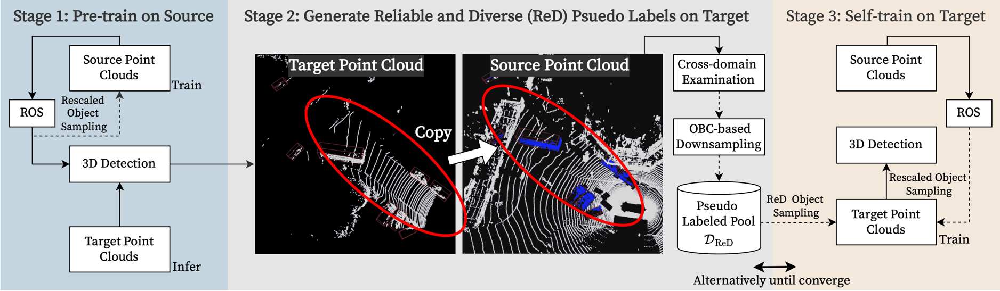

This work is the official Pytorch implementation of our **ICCV2023** publication: "**Revisiting Domain-Adaptive 3D Object Detection by Reliable, Diverse and Class-balanced Pseudo-Labeling**"

[[paper]](https://openaccess.thecvf.com/content/ICCV2023/html/Chen_Revisiting_Domain-Adaptive_3D_Object_Detection_by_Reliable_Diverse_and_Class-balanced_ICCV_2023_paper.html)

## Framework

Unsupervised domain adaptation (DA) with the aid of pseudo labeling techniques has emerged as a crucial approach for domain-adaptive 3D object detection. While effective, existing DA methods suffer from a substantial drop in performance when applied to a multi-class training setting, due to the co-existence of low-quality pseudo labels and class imbalance issues. In this paper, we address this challenge by proposing a novel ReDB framework tailored for learning to detect all classes at once. Our approach produces Reliable, Diverse, and class-Balanced pseudo 3D boxes to iteratively guide the self-training on a distributionally different target domain. To alleviate disruptions caused by the environmental discrepancy (e.g., beam numbers), the proposed cross-domain examination (CDE) assesses the correctness of pseudo labels by copy-pasting target instances into a source environment and measuring the prediction consistency. To reduce computational overhead and mitigate the object shift (e.g., scales and point densities), we design an overlapped boxes counting (OBC) metric that allows to uniformly downsample pseudo-labeled objects across different geometric characteristics. To confront the issue of inter-class imbalance, we progressively augment the target point clouds with a class-balanced set of pseudo-labeled target instances and source objects, which boosts recognition accuracies on both frequently appearing and rare classes. Experimental results on three benchmark datasets using both voxel-based (i.e., SECOND) and point-based 3D detectors (i.e., PointRCNN) demonstrate that our proposed ReDB approach outperforms existing 3D domain adaptation methods by a large margin, improving 23.15% mAP on the nuScenes → KITTI task.
## Installation

Please refer to [INSTALL.md](docs/INSTALL.md) for the installation.

## Getting Started

Please refer to [GETTING_STARTED.md](docs/GETTING_STARTED.md) to learn more usage about this project.

## License

Our code is released under the Apache 2.0 license.
